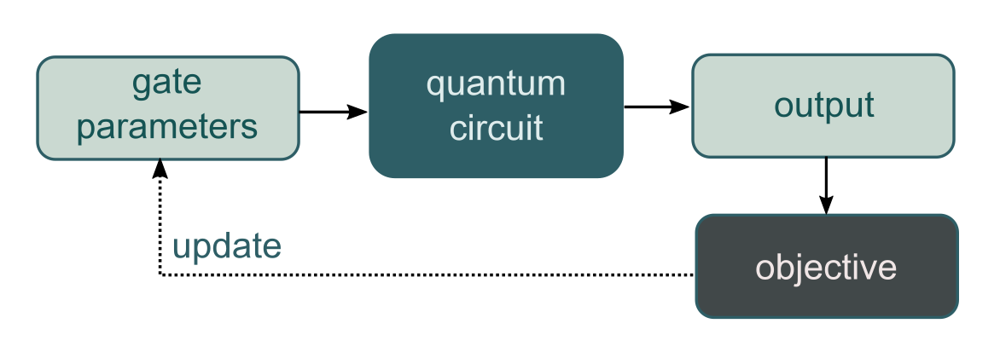

Quantum Machine Learning Toolbox
################################

:Release: |release|
:Date: |today|

The Quantum Machine Learning Toolbox (QMLT) is a `Strawberry Fields <https://strawberryfields.readthedocs.io>`_ application that simplifies the optimization of variational quantum circuits (also known as *parametrized quantum circuits*). Tasks for the QMLT range from variational eigensolvers and unitary learning to supervised and unsupervised machine learning with models based on a parametrized circuit.

|

.. _fig_varrough:

   The idea of :ref:`variational quantum circuits <variational>` is to classically optimize the gate parameters according to an objective.

|

The quantum machine learning toolbox is designed to be used on top of the Strawberry Fields' continuous-variable quantum computing simulator, but can in principle be combined with other quantum programming languages as well.

Features
========

The Quantum Machine Learning Toolbox supports:

* The training of user-provided variational circuits

* Automatic and numerical differentiation methods to compute gradients of circuit outputs

* Optimization, supervised and unsupervised learning tasks

* Regularization of circuit parameters

* Logging of training results

* Monitoring and visualization of training through matplotlib and TensorBoard

* Saving and restoring trained models

* Parallel computation/GPU usage for TensorFlow-based models

Getting started
===============

To install the QMLT on your system, begin at the :ref:`download and installation guide <installation>`. Then, familiarise yourself with :ref:`variational circuits <variational>` and :ref:`things you can do with them <task>`.

For getting started with writing your QMLT code, have a look at the tutorials for the :ref:`numerical learner <tut_numerical>` and the  :ref:`TensorFlow learner <tut_tensorflow>`.

Finally, detailed documentation on the :ref:`QMLT code <code>` is provided.

Support
=======

- **Source Code:** https://github.com/XanaduAI/QMLT
- **Issue Tracker:** https://github.com/XanaduAI/QMLT/issues

If you are having issues, please let us know, either by email or by posting the issue on our GitHub issue tracker.

We have a mailing list located at: support@xanadu.ai.

License
=======

The Quantum Machine Learning Toolbox is **free** and **open-source**, released under the Apache License, Version 2.0.

.. toctree::
   :maxdepth: 2
   :caption: Getting started
   :hidden:

   installing
   research

.. toctree::
   :maxdepth: 2
   :caption: Background
   :hidden:

   variational
   tasks
   definitions
   z_references

.. toctree::
   :maxdepth: 2
   :caption: Tutorials
   :hidden:

   tutorials/numerical
   tutorials/tensorflow
   tutorials/examples

.. toctree::
   :maxdepth: 2
   :caption: Machine Learning Toolbox API
   :hidden:

   code
   code/helpers

.. toctree::
   :maxdepth: 2
   :caption: Numerical Learner
   :hidden:

   code/numerical
   code/numerical.losses
   code/numerical.regularizers
   code/numerical.helpers
   code/numerical.plot

.. toctree::
   :maxdepth: 2
   :caption: TF Learner
   :hidden:

   code/tf
   code/tf.losses
   code/tf.helpers

Indices and tables
==================

* :ref:`genindex`
* :ref:`modindex`
* :ref:`search`
