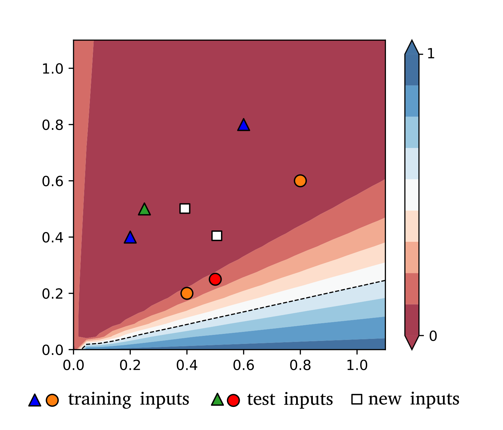
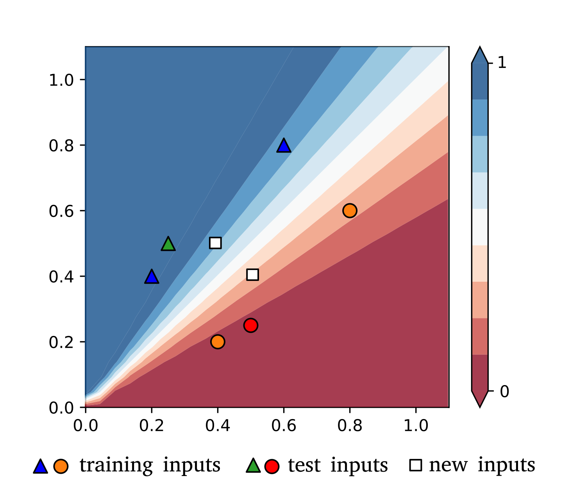

.. role:: raw-latex(raw)
   :format: latex
   
.. role:: html(raw)
   :format: html

.. _tut_numerical:

Numerical learning
==================

The numerical learner is based on Python's `scipy.optimize <https://docs.scipy.org/doc/scipy/reference/optimize.html>`_ library. In addition it implements a stochastic gradient descent method that calls `scipy.optimize.approx_fprime <https://docs.scipy.org/doc/scipy/reference/generated/scipy.optimize.approx_fprime.html#scipy.optimize.approx_fprime>`_ to compute the gradient in every step by a finite differences method.

Optimization
------------

Basic example
*************

In the `Optimization and Machine Learning <https://strawberryfields.readthedocs.io/en/latest/tutorials/tutorial_machine_learning.html>`_ tutorial of the StrawberryFields documentation we saw a simple example of how to optimize a quantum circuit. In the following we will rewrite the example by using the :class:`~.numerical.CircuitLearner` class of the numerical module.

First we have to import StrawberryFields. A ``Dgate`` is needed to construct the variational circuit, the :class:`~.numerical.CircuitLearner` class for optimization, as well as a helper function to create circuit parameters.

.. code-block:: python

    import strawberryfields as sf
    from strawberryfields.ops import Dgate
    from qmlt.numerical import CircuitLearner
    from qmlt.numerical.helpers import make_param

To keep track of the parameters, we introduce them as a list of dictionaries. Each dictionary corresponds to one parameter, and contains at least an initial value and a name. The easiest way to create such a 'parameter-dictionary' is to use the built-in :func:`make_params` function. Here the list only contains one parameter.

.. code-block:: python

    my_init_params = [make_param(constant=0.1, name='alpha')]

Now we have to define a function that contains the variational circuit and defines its output. We will use Blackbird with a StrawberryFields simulator. 

The function takes a list of circuit parameter values of the same length and order as ``my_params``. The name "circuit" could be anything, but the keyword "params" is mandatory. We use the  StrawberryField ``'gaussian'`` backend here, but could of course also use the ``'fock'`` or ``'tf'`` backend (see other tutorials).

.. code-block:: python

    def circuit(params):
    
        eng, q = sf.Engine(1)
    
        with eng:
            Dgate(params[0]) | q[0]
    
        state = eng.run('gaussian')
    
        circuit_output = state.fock_prob([1])
        return circuit_output

Besides the BlackBird code, the :func:`circuit` function returns the probability of measuring one photon in the mode as the circuit output.

We also have to define a loss function :func:`myloss` that takes the circuit output and captures the quality of a circuit. Again, the name of the function is your choice, but the argument ``'circuit_output'`` is mandatory. 

In this tutorial, the loss is simply the negative probability, since we want to minimize the loss.  

.. code-block:: python

    def myloss(circuit_output):
        return -circuit_output

Next, we define the hyperparameters of the model as a python dictionary. Mandatory keys in this dictionary are

* ``'circuit'``,
* ``'init_circuit_params'``,
* ``'task'``, and
* ``'loss'``. 

The other keys are filled with default values if not provided by the user.

We define two more keys. As optimizer, we select ``'SGD'`` for Stochastic Gradient Descent, and we set the initial learning rate to 0.1. The learner will automatically print some default values, amongst them the loss, in every step.

.. note::

    To disable the default printing behaviour, include ``'print_log': False`` in the dictionary of hyperparameters.

.. code-block:: python

    hyperparams = {'circuit': circuit,
                   'init_circuit_params': my_init_params,
                   'task': 'optimization',
                   'loss': myloss,
                   'optimizer': 'SGD',
                   'init_learning_rate': 0.1}

We now construct and train the learner for 50 iterations. We have to pass the hyperparameters to the learner during construction.

.. code-block:: python

   learner = CircuitLearner(hyperparams=hyperparams)
   learner.train_circuit(steps=50)

Running the full example, the numerical learner converges to a loss of :math:`-0.3678794`, which means that the final probability is :math:`0.3678794`.

Including regularization, penalty and monitoring
************************************************

Regularization
++++++++++++++

In the basic example, we now replace a few lines of code to add more features. First, we make the parameters with the command

.. code-block:: python

    my_init_params = [make_param(constant=0.1, name='alpha', regularize=True)]

The third argument marks the parameter to be regularized, which adds a penalty to the cost function that depends on the parameter's value. We also want to monitor the parameter so we can plot it. We define the regularization penalty

.. code-block:: python

    def myregularizer(regularized_params):
        return l2(regularized_params)

These can be inserted after defining ``myloss()`` in the basic example. Again, the name ``'myregularizer'`` is your choice, but the keyword ``'regularized_params'`` is mandatory.

This function is a regularizer that penalises large values of parameters marked for regularization. More precisely, it uses a regularization function :func:`~.numerical.regularizers.l2` imported from the :mod:`qmlt.numerical.regularizers` module and simply computes the squared Euclidean length of the vector of all parameters. To use :func:`~.numerical.regularizers.l2` we have to import it at the beginning of the script via

.. code-block:: python

    from qmlt.numerical.regularizers import l2

To use regularization, we have to add it to the hyperparameter dictionary (the order of keys does not matter):

.. code-block:: python

    hyperparams = {...
                   'regularizer': myregularizer,
                   'regularization_strength': 0.5,
                   ...
                   }

The key ``'regularization_strength'`` regulates the strength with which the regularizer is applied. If the strength is set to 0, the result is the same as in the basic example. A large ``regularization_strength`` makes the parameter alpha go to zero. Try it!

You can print the final circuit parameter(s) either like this,

.. code-block:: python

    final_params = learner.get_circuit_parameters()
    for name, value in final_params.items():
        print("Parameter {} has the final value {}.".format(name, value))

or, easier, by setting ``print_only`` to true:

.. code-block:: python

    final_params = learner.get_circuit_parameters(only_print=True)

Monitoring
+++++++++++

To also plot the circuit parameter, create the parameter via

.. code-block:: python

    my_init_params = [make_param(constant=0.1, name='alpha', regularize=True, monitor=True)]

and add 

.. code-block:: python

    hyperparams = {...
                   'plot': True,
                   ...
                   }

to the hyperparameters. The integer defines how often the plotting data is generated. Simply including this key with a nonzero value into the hyperparameters plots some default values.

.. warning:: 

    In some programming environments such as the IPython console, the plot might only be shown after the training has finalized.

Custom logging
++++++++++++++

Besides regularization and monitoring, one can customize which values are logged during SGD training.

For this, define a dictionary inside :func:`circuit` with the variables you want logged, and return it as a second argument of the function. The keys of the dictionary are the strings used to name the values in the printout.

.. code-block:: python

    def circuit(params):
    
        eng, q = sf.Engine(1)
    
        with eng:
            Dgate(params[0]) | q[0]
    
        state = eng.run('fock', cutoff_dim=7)
    
        circuit_output = state.fock_prob([1])
        trace = state.trace()
    
        log = {'Prob': circuit_output,
               'Trace': trace}

        return circuit_output, log

Unsupervised learning
---------------------

We now look at an example of unsupervised learning. The :func:`circuit` function returns the quantum state itself as an output. The loss is the probability of some particular measurement outcomes (in our case, Fock states). In other words we want to learn a quantum circuit that prepares a state from which our data is likely to be sampled.

Basic example
*************

As an example for an unsupervised task, we will train the variational circuit to prepare a certain measurement distribution learnt from data. 

We import some classes and helpers.

.. code-block:: python

    import strawberryfields as sf
    from strawberryfields.ops import *
    import numpy as np
    from qmlt.numerical import CircuitLearner
    from qmlt.numerical.helpers import make_param
    from qmlt.numerical.regularizers import l2
    from qmlt.helpers import sample_from_distr

Next we define some parameters.

.. code-block:: python

    my_params = [
        make_param(name='phi', stdev=0.2, regularize=False),
        make_param(name='theta', stdev=0.2, regularize=False),
        make_param(name='a', stdev=0.2, regularize=True),
        make_param(name='rtheta', stdev=0.2, regularize=False),
        make_param(name='r', stdev=0.2, regularize=True),
        make_param(name='kappa', stdev=0.2, regularize=True)
    ]

In the circuit we may use the ``'fock'`` backend. Don't forget to define the cutoff dimension of the simulation.

.. code-block:: python

    def circuit(params):
    
        eng, q = sf.Engine(2)
    
        with eng:
            BSgate(params[0], params[1]) | (q[0], q[1])
            Dgate(params[2]) | q[0]
            Rgate(params[3]) | q[0]
            Sgate(params[4]) | q[0]
            Kgate(params[5]) | q[0]
    
        state = eng.run('fock', cutoff_dim=7)
        circuit_output = state.all_fock_probs()
        
        return circuit_output

We define a loss, regularizer and generate some training data. The task is to create a quantum state that favours Fock states that have a high probability of zero photons in the first mode, irrespective of the photon number in the second mode.

.. code-block:: python

    def myloss(circuit_output, X):
        probs = [circuit_output[x[0], x[1]] for x in X]
        prob_total = sum(np.reshape(probs, -1))
        return -prob_total

    def myregularizer(regularized_params):
        return l2(regularized_params)

    X_train = np.array([[0, 1],
                        [0, 2],
                        [0, 3],
                        [0, 4]])

.. note::

    The loss for an unsupervised learning task must have two keyword arguments, ``circuit_output`` and ``X``.

As an optimizer we use the derivative-free Nelder-Mead optimization this time.

.. note::

    Printing in every iteration is very expensive for other optimizers than `'SGD'`, since the current implementation optimizes for one step and prints, which causes a significant overhead. We can reduce the number of logs with the     'log_every'` hyperparameter key.

.. code-block:: python

    hyperparams = {'circuit': circuit,
                   'init_circuit_params': my_params,
                   'task': 'unsupervised',
                   'optimizer': 'Nelder-Mead',
                   'loss': myloss,
                   'regularizer': myregularizer,
                   'regularization_strength': 0.1,
                   'log_every': 100
                   }

    learner = CircuitLearner(hyperparams=hyperparams)

When training the learner, we feed it with the training data:

.. code-block:: python

    learner.train_circuit(X=X_train, steps=500)

.. note:: The Nelder-Mead algorithm is faster, but usually takes many more steps to converge.

To test if training was successful, we sample Fock states from the final state of the trained circuit. We get the final distribution using the :meth:`~.numerical.CircuitLearner.run_circuit` function, which returns a dictionary of different outcomes (see later tutorials). The ``circuit_ouput`` that we defined in :func:`circuit` is the value of the key ``'outputs'``.

.. code-block:: python

    outcomes = learner.run_circuit()
    final_distribution = outcomes['outputs']

We can then use a helper :func:`sample_from_distr` to "measure" Fock states from the final state. The sampled Fock states should favour zero photons in the first mode.

.. code-block:: python

    for i in range(10):
        sample = sample_from_distr(distr=final_distribution)
        print("Fock state sample {}:{}".format(i, sample))

We can see that the circuit in this basic example does not learn to prepare a state from which we measure the desired Fock states. We will revisit the same example with a richer architecture.

Working with layered circuit architectures
******************************************

We use the unsupervised example to demonstrate how to build circuits out of mutliple layers of a gate sequence. The creation of parameters and the circuit function works as follows. As parameters, we generate the same gate sequence 'depth' times, and add the layer number to the parameter name.  

.. code-block:: python

    depth = 5
    
    my_params = []
    
    for i in range(depth):
        my_params.append(make_param(name='phi_' + str(i), stdev=0.2, regularize=False))
        my_params.append(make_param(name='theta_' + str(i), stdev=0.2, regularize=False))
        my_params.append(make_param(name='a_'+str(i), stdev=0.2, regularize=True, monitor=True))
        my_params.append(make_param(name='rtheta_'+str(i), stdev=0.2, regularize=False, monitor=True))
        my_params.append(make_param(name='r_'+str(i), stdev=0.2, regularize=True, monitor=True))
        my_params.append(make_param(name='kappa_'+str(i), stdev=0.2, regularize=True, monitor=True))

In the circuit we reshape the parameters so that the first dimension refers to the layer and the second to the gate in that layer. This makes accessing the parameters in the next step easier. The access is done by defining a :func:`layer` function, and calling it with the engine while iterating over the layers.

.. code-block:: python

    def circuit(params):
    
        params = np.reshape(params, (depth, 6))
    
        def layer(i):
            BSgate(params[i, 0], params[i, 1]) | (q[0], q[1])
            Dgate(params[i, 2]) | q[0]
            Rgate(params[i, 3]) | q[0]
            Sgate(params[i, 4]) | q[0]
            Kgate(params[i, 5]) | q[0]
    
        eng, q = sf.Engine(2)
    
        with eng:
            for d in range(depth):
                layer(d)
    
        state = eng.run('fock', cutoff_dim=7)
        circuit_output = state.all_fock_probs()
        
        circuit_output = np.reshape(circuit_output, (7, 7))
        return circuit_output

This time the circuit learns to sample Fock states with zero photons in the first mode. In fact, it learns to generalize: You will sometimes find states :math:`|0,5\langle` and higher, which were not in the training set. Increasing the depth (number of layers) makes the circuit more flexible.

Supervised learning
-------------------

Basic example
*************

As an example for supervised learning, we train the variational circuit to distinguish between two classes in a binary 2D pattern recognition task.

First, import StrawberryFields, some gates, the learner and some helpers.

.. code-block:: python

    import strawberryfields as sf
    from strawberryfields.ops import Dgate, BSgate
    import numpy as np
    from qmlt.numerical import CircuitLearner
    from qmlt.numerical.helpers import make_param
    from qmlt.numerical.losses import square_loss

We create a parameter that is set to 2.

.. code-block:: python

    my_init_params = [make_param(constant=2.)]

The :func:`circuit` function takes the input data for supervised learning tasks. Since the data contains a batch of inputs, we have to include another function which executes the quantum circuit for single input vectors. This is necessary since while StrawberryFields' ``'tf'`` backend processes batches ``X`` of inputs ``x``, the ``'fock'`` backend can only be fed with one input at a time.

.. code-block:: python

    def circuit(X, params):
    
        eng, q = sf.Engine(2)
    
        def single_input_circuit(x):
    
            eng.reset()
            with eng:
                Dgate(x[0], 0.) | q[0]
                Dgate(x[1], 0.) | q[1]
                BSgate(phi=params[0]) | (q[0], q[1])
                BSgate() | (q[0], q[1])
            state = eng.run('fock', cutoff_dim=10, eval=True)
    
            p0 = state.fock_prob([0, 2])
            p1 = state.fock_prob([2, 0])
            normalisation = p0 + p1 + 1e-10
            outp = p1/normalisation
            return outp
    
        circuit_output = [single_input_circuit(x) for x in X]
    
        return circuit_output

The output of the model is defined as the probability of measuring Fock state :math:`|0,2\rangle` as opposed to Fock state :math:`|2,0\rangle`.

.. note::

   The probability of measuring a Fock state can be very small. Instead of using this probability as the output of a model, it is often better to define two different probabilities and compare between them.

Constructing and training the learner is similar in structure to the optimization tutorial, except from feeding the training data  ``X_train``, ``Y_train`` into :func:`train_circuit`.

As a loss we use a square loss imported above from the numerical module. 

.. note::

    The loss for a supervised learning task must have two keyword arguments, ``circuit_output`` and ``targets``.

.. code-block:: python

    def myloss(circuit_output, targets):
        return square_loss(outputs=circuit_output, targets=targets)

Now we have to create some data

.. code-block:: python

   X_train = np.array([[0.2, 0.4], [0.6, 0.8], [0.4, 0.2], [0.8, 0.6]])
   Y_train = np.array([1., 1., 0., 0.])
   X_test = np.array([[0.25, 0.5], [0.5, 0.25]])
   Y_test = np.array([1., 0.])
   X_pred = np.array([[0.4, 0.5], [0.5, 0.4]])

Finally, we define the hyperparameters, construct the learner and train it (passing inputs *and* targets this time).

.. code-block:: python

    hyperparams = {'circuit': circuit,
                   'init_circuit_params': my_init_params,
                   'task': 'supervised',
                   'loss': myloss,
                   'optimizer': 'SGD',
                   'init_learning_rate': 0.5
                   }

    learner = CircuitLearner(hyperparams=hyperparams)

    learner.train_circuit(X=X_train, Y=Y_train, steps=50)

We can now score a test set and get the predictions for a set of new inputs defined above. First, define how circuit outputs translate to model predictions. Again, the keyword argument `circuit_output` is mandatory.

.. code-block:: python

    def outputs_to_predictions(circuit_output):
        return round(circuit_output)

Now, score the circuit.

.. code-block:: python

      test_score = learner.score_circuit(X=X_test, Y=Y_test, outputs_to_predictions=outputs_to_predictions)

The output of :func:`score_circuit` is a dictionary of scores of which we select the loss and accuracy.

.. code-block:: python

    print("\nPossible scores to print: {}".format(list(test_score.keys())))
    print("Accuracy on test set: {}".format(test_score['accuracy']))
    print("Loss on test set: {}".format(test_score['loss']))

Finally, we can predict the new input ``X_pred``.

.. code-block:: python

    predictions = learner.run_circuit(X=X_pred,
                                      outputs_to_predictions=outputs_to_predictions)
    print("\nPredictions for new inputs: ", predictions['outputs'])

The classifier defined by the quantum circuit implements a linear decision boundary on the 2-dimensional input space, which goes through the origin. After one epoch, the classifier defines the following decision regions.

|

.. _num_fig_after1:

    Decision boundary after 1 training step. The blue and red regions show the output of the variational circuit. Circles stand for inputs with target output 0, while triangles represent inputs with target output 1. The white squares stand for new inputs whose targets are unknown.

|

Training moves the angle of the boundary and switches the assignment of the regions, so that after 100 training steps our symmetric data set is perfectly fitted.

|

.. _num_fig_after100:

   Decision boundary after 100 training steps. The variational circuit learnt to classify the data correctly, since all circles lie in the red region, while triangles lie in the blue region.

|

Using an adaptive learning rate, printing, warm start and batch mode
*********************************************************************

In the supervised learning example we can extend the hyperparameters by these three keys:

.. code-block:: python

               'decay': 0.5,
               'log_every': 10,
               'warm_start': True,

This 

* introduces a step-dependent decay into the learning rate, 
* prints out the results every 10th step, and 
* chooses a warm start, which loads the final parameters from the previous training. (You can see that the global step starts where it ended the last time you ran the script.)

.. note::

    You now have to train for a bit longer to reach the same accuracy as before, since the algorithm has a shorter step size.

.. warning::

    The warm_start option can only be used if a model with the same number of circuit parameters has been trained before.
    
To change the batch size of training (i.e., the amount of training inputs used for each parameter update) to 2, we train the learner using

.. code-block:: python

    learner.train_circuit(X=X_train, Y=Y_train, steps=50, batch_size=2)

Of course, changing the batch size is also interesting for unsupervised learning tasks and works the same.

