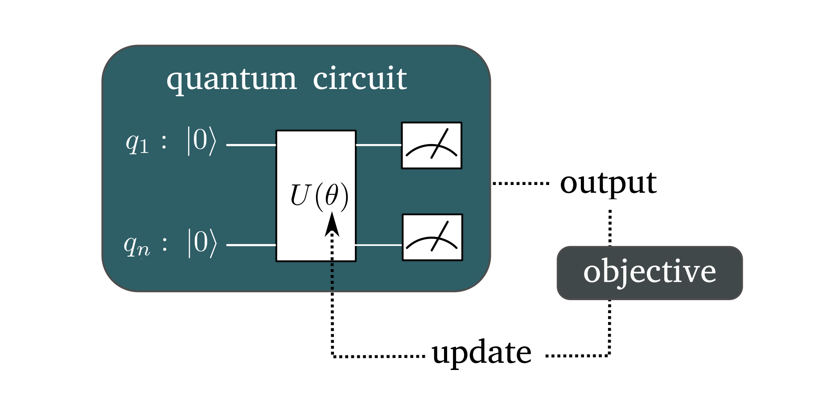

.. role:: raw-latex(raw)
   :format: latex

.. role:: html(raw)
   :format: html

.. _variational:

Variational Circuits
======================

.. sectionauthor:: Maria Schuld <maria@xanadu.ai>

Variational circuits (also called *parametrized quantum circuits*) are a family of hybrid quantum-classical algorithms :cite:`mcclean16`. At the core of the algorithm is a *quantum circuit* :math:`U` which depends on a set of :term:`circuit parameters <Circuit parameters>` :math:`\theta`, as well as an *objective function* which defines a scalar score for each set of parameters. The goal is to optimise or train the circuit with respect to the objective.

|

.. _fig_variational:

   The principle of a variational circuit.

|

Typically, variational circuits are trained by a classical optimization algorithm that makes queries to the quantum device. The optimization is usually an iterative scheme that finds better candidates for the parameters :math:`\theta` in every step, starting with either random or pre-trained initial parameters.

When running a StrawberryFields simulation one can use *numerical* or *automatic* strategies to update the parameters in each step.

Numerical training
------------------------

Numerical training methods use the quantum circuit as a blackbox. There are basically two subgroups of these methods:

Derivative-free optimization
****************************

`Derivative-free training methods <https://en.wikipedia.org/wiki/Derivative-free_optimization>`_ do not compute gradients to determine the search direction for the parameter update.

Examples of such methods are

* The `Nelder-Mead <https://en.wikipedia.org/wiki/Nelder%E2%80%93Mead_method>`_ or simplex method
* Evolutionary algorithms
* Particle swarm optimization

Most derivative-free methods treat the objective and thereby the variational circuit as a black-box to query. They are hence easy to use, but not always numerically stable. Especially for large sets of parameters, one might be better of with gradient-based methods.

.. _numerical_differentation:

Gradient-based optimization
****************************

Gradient-based training methods take information on the direction of steepest descent in the objective function into account, but at the cost of having to compute derivatives of the objective, and thereby of the variational circuit outputs.

Numerical gradient-based methods compute approximations to the gradients. Usually this is done by the `finite-differences <https://en.wikipedia.org/wiki/Finite_difference>`_ method. The value of the objective function is evaluated at two positions close to the current circuit parameters :math:`\theta`.

More precisely, let :math:`\mu \in \theta` be the parameter that we want to update, and let :math:`C(\mu)` be the objective function that depends on :math:`\mu`. The approximation of the gradient is then given by

.. math::

   \partial_{\mu} C(\mu) \approx \frac{C(\mu - \frac{1}{2}\Delta \mu ) - C(\mu + \frac{1}{2} \Delta \mu)}{\Delta \mu}

One problem is that :math:`\Delta \mu` has to be as small as possible for good approximations, but still large enough to make the finite difference larger than the error in estimating :math:`C(\mu)`, which can be quite significant in current quantum technologies.

.. note::

   The finite-difference method can in principle also be used if the simulation is replaced by quantum hardware.

.. _automatic_training:

Automatic training
------------------

Automatic training is based on `automatic differentiation <https://en.wikipedia.org/wiki/Automatic_differentiation>`_, which is a programming technique that associates each computational operation with a gradient taken with respect to some user-defined variables. Whatever computation is performed, one can automatically compute the gradient of the result. This is very useful for quantum machine learning, because it allows us to retrieve the analytic derivative of a variational circuit output without finding gradients on paper for each circuit architecture, and then implementing them as a training algorithm.

A popular framework that supports automatic differentiation is `TensorFlow <https://www.tensorflow.org/>`_. The ``'tf'`` backend of StrawberryFields is coded in TensorFlow and when a circuit is run with this backend (and in the ``run()`` method for the engine we set ``evaluation=False``), the result of the circuit are tensors that have gradients associated with them. The machine learning toolbox uses this to build machine learning models.

.. note::

   Automatic differentiation is a feature of simulations only, and has no equivalent when using real quantum hardware!

